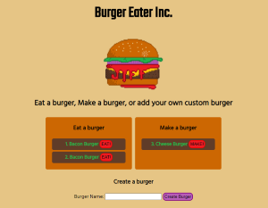

# Burger Eater
[](https://lbesson.mit-license.org/)


## Description
Burger Eater is a place to eat burgers. Type in your favorite burger, then click eat to eat it! Once you've eaten it, click make to make it again and the cycle starts all over again. Burger Eater is built with Node.js and express, is powered by MySQL and Handlebars, and uses a custom orm for database interaction. 

## Table of Contents
* [Installation](#Installation)
* [Usage](#Usage)
* [Questions](#Questions)

## Installation
To install necessary dependencies, run the following command:
```
npm install
``` 

## Usage
This app does not actually make burgers. It's just pretend. But it is a wonderful, magical pretend. So, enjoy! This app is deployed at https://eb-burger-eater.herokuapp.com/. To run locally, install dependencies (see above) then run `npm start` and navigate to localhost:8080.

## License
[](https://lbesson.mit-license.org/) 

This application is covered by the MIT license.

## Questions
Find all of my repos at elijah415hz. 

Please email me at elijahblaisdell@gmail.com with any questions.
